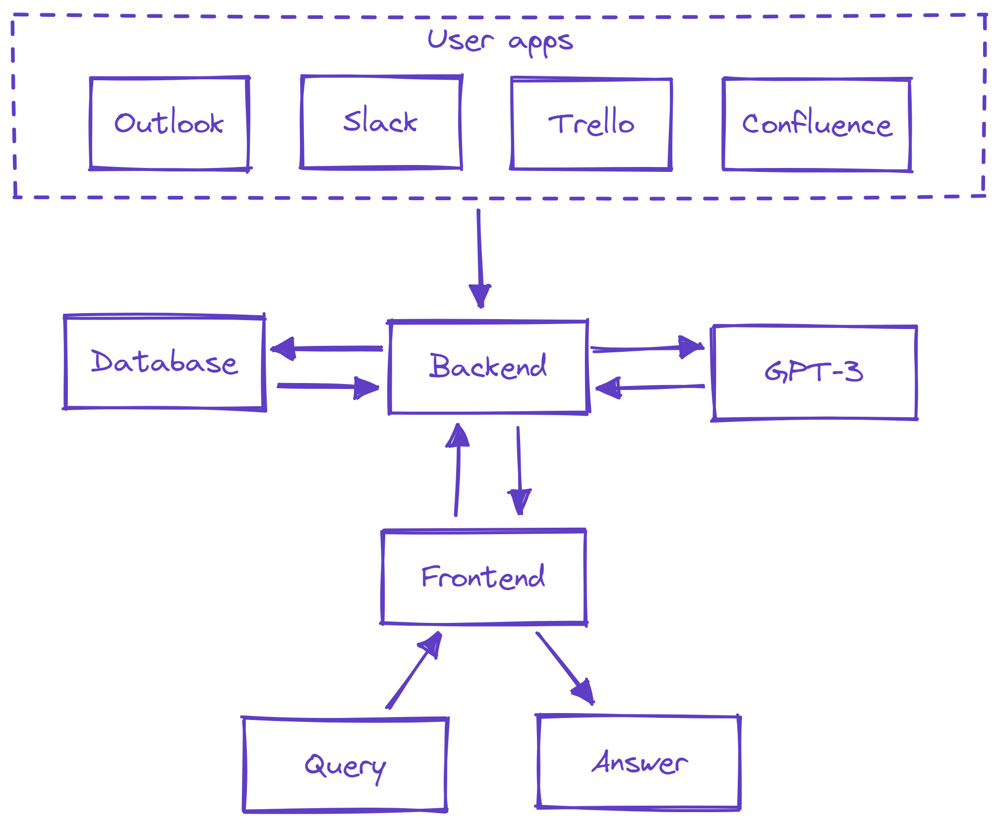

<h1 align="center">Introducing Persona AI</h1>

## The Problem
Modern enterprises face a huge setback when a high-value employees resign. These employees have a high dependency on them for running the business. They leave a knowledge gap in their wake and it takes a while for their replacement to fill in.

## The Solution
**Persona AI is the generative AI solution that preserves the experience of your employees within the business.** It gathers employee data in the background and overtime gains enough knowledge to create a virtual persona of the employee. This persona, in the form of a chat-bot, is now accessible by them or their replacement for consultation.

## Use cases
- Persona AI acts as a second brain of employees that can answer queries on their behalf
- An employee can consult their own persona for solving problems they faced in the past
- A new employee can ask questions without hesitations or insecurity

## Steps
1. The enterprise integrates Persona in their environment locally
2. Employees work as usual but their data is recorded in the background
3. Employee persona is generated when enough data has been collected
4. This persona is now accessible to them, their peers or their successors

## Workflow overview

